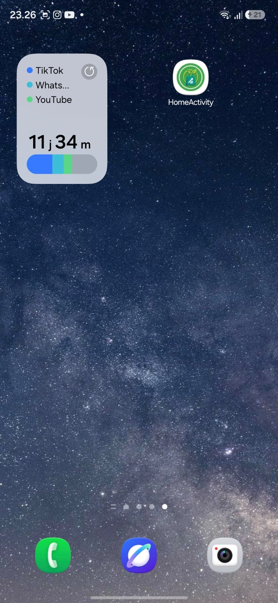
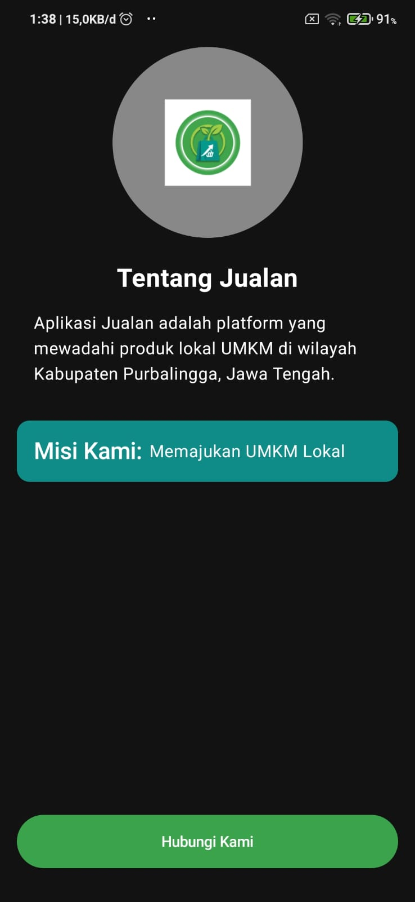
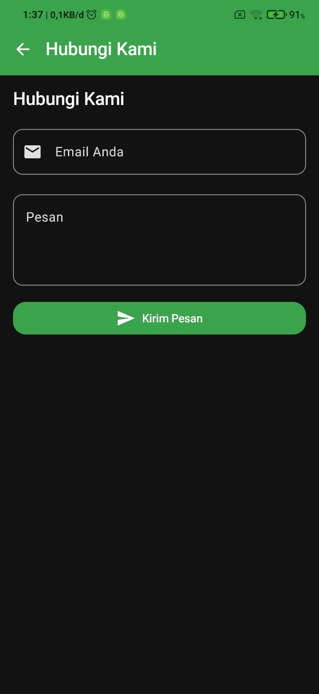
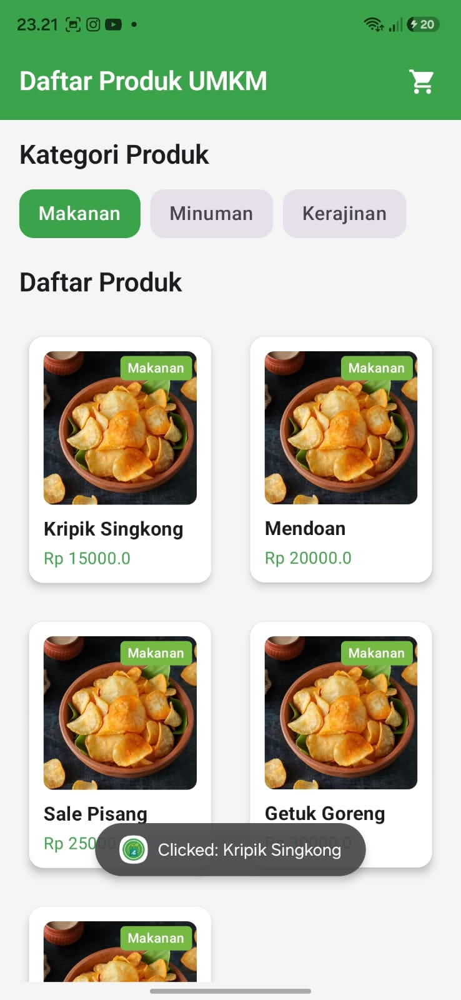
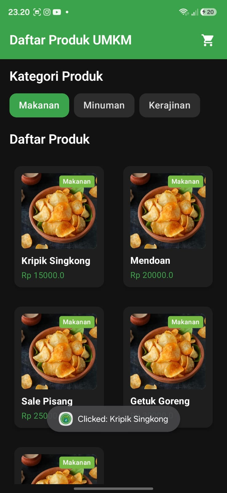

# Laporan Praktikum Pemrograman Mobile

**Nama** : Melysa Ayu Wulan Sari   
**NIM** : H1D024046   
**Shift** : Awal D / Akhir E   
**Praktikum** : Pemrograman Mobile

---

## 📄 Tugas Pertemuan 1
**Tanggal**: Selasa, 2 September 2026

 

**Kesimpulan Praktikum:**
Pada pertemuan pertama, praktikan mempelajari dasar pembuatan antarmuka menggunakan Jetpack Compose, membangun struktur halaman awal aplikasi, serta mengonfigurasi tata letak komponen UI seperti gambar, teks, dan tombol aksi secara interaktif.

---

## 📄 Tugas Pertemuan 2
**Tanggal**: Selasa, 9 September 2026

 

**Kesimpulan Praktikum:**
Pertemuan kedua menekankan pada implementasi fitur interaktif dalam aplikasi mobile. Mahasiswa belajar bagaimana menghubungkan antarmuka dengan logika program sehingga aplikasi dapat merespons input pengguna secara dinamis dan memberikan pengalaman yang lebih baik.

---

## 📄 Tugas Pertemuan 3
**Tanggal**: Selasa, 16 September 2026

 

**Kesimpulan Praktikum:**
Pada pertemuan ketiga, praktikan mempelajari konsep Dynamic Lists dan Lazy Layouts menggunakan `LazyRow` dan `LazyVerticalGrid` untuk menampilkan data dalam jumlah banyak secara efisien. Selain itu, praktikan juga mengimplementasikan Data Class, struktur data dummy, serta pengelolaan `HomeActivity` sebagai launcher utama aplikasi.
